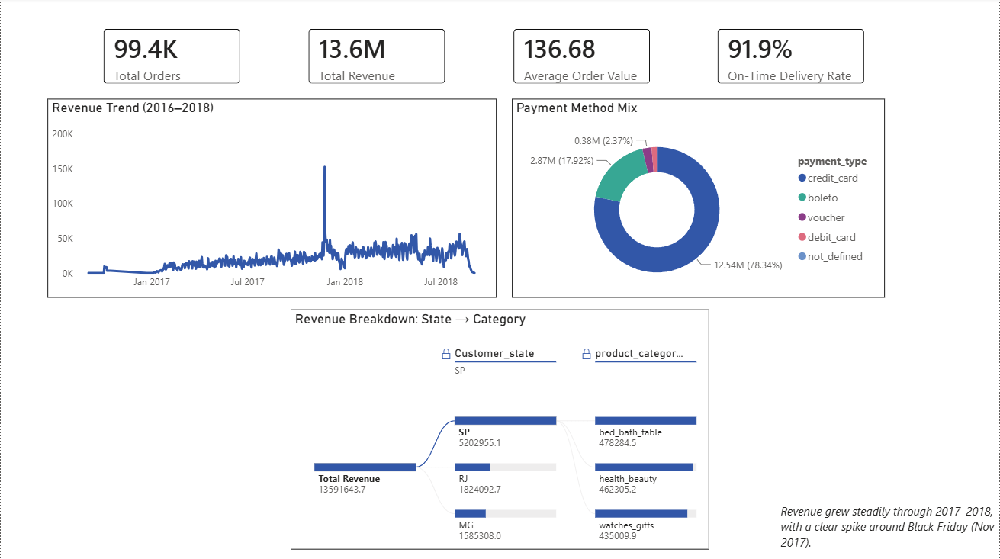

# Brazilian E-Commerce Analysis — Olist (2016–2018)

An interactive Power BI dashboard analysing **99,441 real orders** placed through Olist, Brazil's largest online marketplace, built on a genuine **9-table relational data model** (7+ relationships), DAX measures including time intelligence, and Power BI–exclusive features not available in Excel: Map, Key Influencers, Decomposition Tree, drillthrough, and bookmarks.



## Business questions answered

- What's our overall order volume, revenue, average order value, and on-time delivery performance, and how does revenue trend over time and across payment methods?
- Where are our customers located, and which Brazilian states drive the most revenue?
- Which product categories generate the most revenue, and how do sellers perform by region?
- Does delivery speed actually affect customer satisfaction — and what else drives review scores up or down?
- Can a viewer drill from a summary number (e.g. a state's total) down to the individual orders behind it?

## Key insights

- **Delivery speed is the single biggest driver of satisfaction.** Orders delivered in 0–11 days average a review score 0.7 points higher than the dataset average — the largest effect of any factor tested via Key Influencers. Being a São Paulo-based customer adds a further +0.19.
- **São Paulo dominates from both sides of the marketplace, for different reasons.** SP-based *customers* account for 5.2M of the 13.6M total revenue (38%), but SP-based *sellers* generate 8.75M (64%) — because São Paulo is Brazil's commercial and logistics hub, sellers based there ship to customers nationwide, not just locally. Revenue-by-seller and revenue-by-customer are genuinely different cuts of the same data, not a contradiction.
- **Health & beauty, watches & gifts, and bed & bath are the top 3 categories by revenue**, out of 71 translated product categories.
- **Payment behaviour matches independently-published benchmarks for this dataset**: 78.3% credit card, 17.9% boleto (Brazilian bank-slip payment), 2.4% debit card — a useful sanity check that the model is computing correctly, not just producing plausible-looking numbers.
- **The clear spike in the revenue trend around November 24, 2017 is Black Friday**, not a data quality issue — a genuine, well-documented seasonal event in Olist's public dataset.
- **91.9% on-time delivery rate**, defined as delivered orders arriving on or before their estimated delivery date.

## Skills demonstrated

- **Data modeling**: 9 related tables, 7 relationships, correct cardinality decisions (including a genuine one-to-one between Orders and Customers, since Olist regenerates `customer_id` per order)
- **Power Query / ETL**: date/timestamp type-fixing, a deliberate many-to-one deduplication (Geolocation: ~1,000,000 raw rows collapsed to ~19,000 via `Group By` + average lat/long), a translation-table merge (Portuguese → English product categories), custom columns and flags
- **DAX**: measures including `DISTINCTCOUNT`, `CALCULATE` with explicit `FILTER()` for column-vs-column comparisons, `TOTALMTD`/`TOTALYTD` time intelligence, and `CROSSFILTER` overrides to correctly propagate filters through single-direction relationships (e.g. making `Total Orders` respond correctly when sliced by seller state or review score)
- **Visuals**: Map (geographic bubble chart), Key Influencers, Decomposition Tree, drillthrough page, bookmarks with button-based navigation
- **Debugging depth**: diagnosed and fixed a Date-vs-Text relationship mismatch, a Power Query custom-column type bug, a scatter chart collapsing to a single aggregate point (missing Legend field), and Key Influencers' one-hop many-to-one modeling constraint — the same class of relationship-propagation issue first encountered in the Excel/Power Pivot project, now solved a second time in a different tool

## Data model

Orders sits at the centre of the model, related to OrderItems, Customers, Payments, and Reviews; OrderItems relates out to Products (translated via CategoryTranslation) and Sellers; Customers and Sellers each relate to Geolocation via zip-code prefix; a standalone DateTable powers all time-intelligence measures.

## Repository structure

```
Brazilian E-Commerce Analysis (Olist)/
├── Brazilian E-Commerce Analysis (Olist).pbix       # main file — open this
├── Brazilian E-Commerce Analysis (Olist).pbip       # Power BI Project format
├── Brazilian E-Commerce Analysis (Olist).Report/    # .pbip report definition
├── Brazilian E-Commerce Analysis (Olist).SemanticModel/  # .pbip data model definition
├── Images/
│   ├── Overview.png
│   ├── Geography.png
│   ├── product Performance.png
│   ├── Delivery & satisfaction.png
│   └── Order Details.png
├── *.csv                                            # raw Olist source data — not committed, see below
├── README.md
└── .gitignore
```

## How to use

1. Open `Brazilian E-Commerce Analysis (Olist).pbix` in Power BI Desktop (free) — no sign-in required to view or explore.
2. Use the slicers, cross-filtering, drillthrough (right-click a state on the Geography page → Drillthrough → Order Detail), and bookmarks to explore interactively.
3. **Home → Refresh** rebuilds the model from the source CSVs, if you've downloaded them to the same folder (see Data below).

## Data

[Brazilian E-Commerce Public Dataset by Olist — Kaggle](https://www.kaggle.com/datasets/olistbr/brazilian-ecommerce), ~100,000 orders, 2016–2018.

> Raw CSV files (~121 MB combined) are **not committed** to this repository to keep it lean — download them from the Kaggle link above and place them alongside the `.pbix` file to refresh the model yourself. The dashboard itself opens fully pre-loaded with no action needed.

## About this project

This is the **Power BI** piece of a broader data analytics portfolio. An **Excel/Power Pivot** dashboard on a separate LinkedIn job-postings dataset is also available, and a **SQL/Python** piece using the same LinkedIn dataset is on the way.

**Author:** Sangram — [LinkedIn](www.linkedin.com/in/sangram-bharat-associate-analyst) · [GitHub](https://github.com/sangrambharatjobs)
